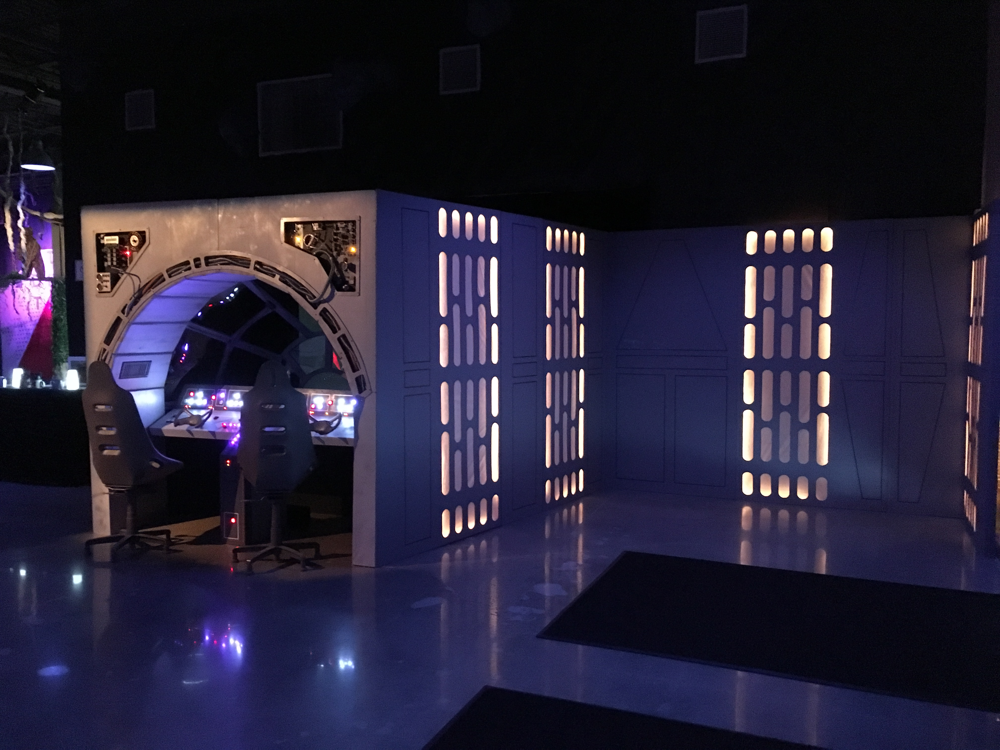

# At the Movies - Millenium Falcon

Code that supports the Millenium Falcon build done for At the Movies (2018). This controls the switching of space/hyperspeed video playback and the looping [MF Ambient Sound.mp3](./media/MF_Ambient_Sound.mp3) audio file.

## Startup

The original build used a Raspberry Pi 3 Model B. The main workings are found in [falcon.js](./falcon.js) and this is set to run as a service on startup via [systemd](https://www.raspberrypi.org/documentation/linux/usage/systemd.md). The following commands can be used to control that service:

* `sudo systemctl start milleniumFalcon.service`
* `sudo systemctl stop milleniumFalcon.service`
* `sudo systemctl enable milleniumFalcon.service`
* `sudo systemctl disable milleniumFalcon.service`

## GPIO Setup

### Wiring

The wiring is super simple -- GPIO pin 17 and ground are run to a switch, which is interupted
when the level reaches the end of it's pull.

### Pullup Resistor

When working with buttons there will often be button bounce issues which result in the hardware thinking that a button was pressed several times although it was only pressed once. The node onoff module helps with this by allowing for a `debounceTimeout` argument, but it was still necessary to configure pin 17 to use a software pullup resistor so that the values were read correctly. This is accomplished by putting the following line in `/boot/config.txt`:

`gpio=17=pu`

Reference:

* [Using the gpio Command in /boot/config.txt](https://www.npmjs.com/package/onoff#using-the-gpio-command-in-bootconfigtxt)
* [gpio config command](https://www.raspberrypi.org/forums/viewtopic.php?f=117&t=208748)